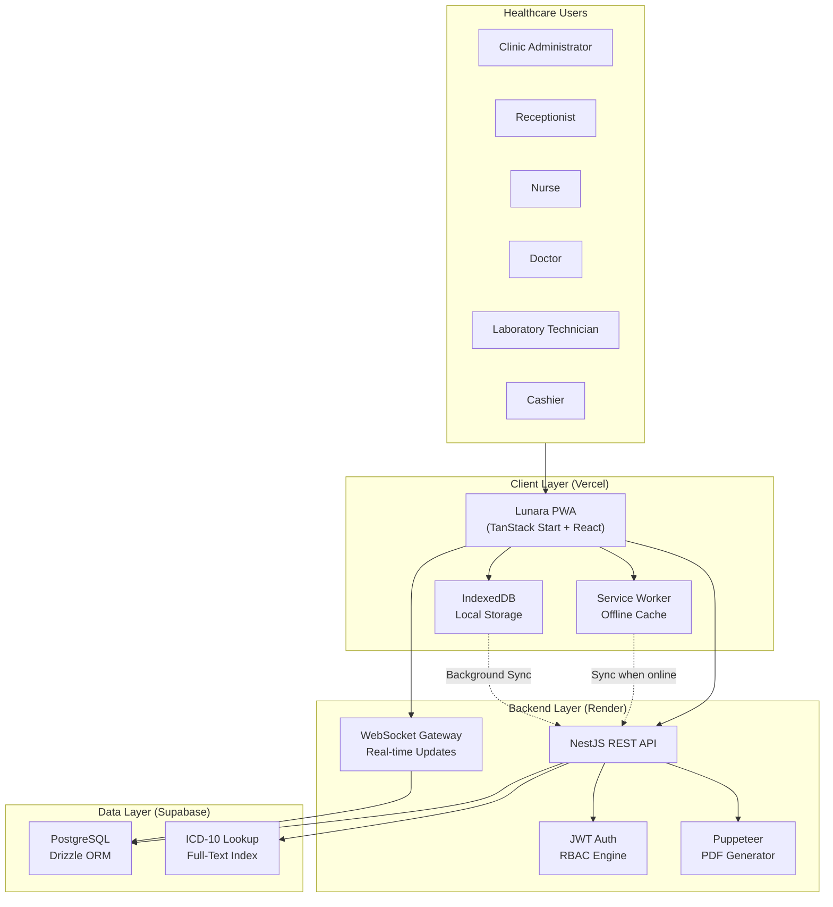
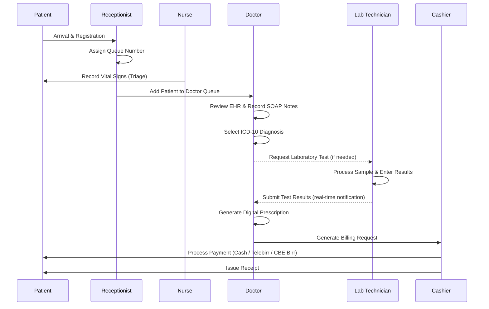

# Lunara

## Digital Clinic Management & Electronic Health Record Platform

Lunara is an **offline-first Progressive Web Application (PWA)** designed to digitize outpatient clinic operations in Ethiopia. It connects clinic administrators, receptionists, doctors, nurses, laboratory technicians, and cashiers through a unified, role-based digital healthcare workflow platform.

The platform replaces manual paper-based processes with a secure, fast, and coordinated digital system for managing patient records, appointments, consultations, laboratory workflows, electronic prescriptions, and billing operations.

> **Status:** Active development — Junior Full-Stack Developer Internship Project at Sof Omar Technologies.

---

## Table of Contents

- [Problem Statement](#problem-statement)
- [Proposed Solution](#proposed-solution)
- [Features](#features)
- [User Roles](#user-roles)
- [Technology Stack](#technology-stack)
- [System Architecture](#system-architecture)
- [Core Workflow](#core-workflow)
- [Documentation](#documentation)
- [Development Setup](#development-setup)
- [Environment Variables](#environment-variables)
- [Branching Strategy](#branching-strategy)
- [Roadmap](#roadmap)
- [Future Enhancements](#future-enhancements)
- [License](#license)

---

## Problem Statement

Many private clinics and diagnostic centers in Ethiopia still rely on handwritten medical files, paper prescriptions, and manual queue systems. These workflows create real operational challenges:

- **Lost or incomplete patient medical histories** — Physical paper folders are easily misplaced, and retrieving a file can take minutes during busy clinic hours.
- **Long, unpredictable waiting times** — Without digital scheduling, patients experience chaotic queues in reception areas.
- **Unreadable handwritten prescriptions** — Illegible handwriting increases the risk of medication dispensing errors.
- **Fragmented billing and revenue leakage** — Manual cross-referencing between consultation desks, lab orders, and the cashier frequently results in unbilled services.
- **Disconnected diagnostic results** — Lab reports are physically carried back to doctors, slowing critical medical decisions.

---

## Proposed Solution

Lunara provides a high-performance digital healthcare platform enabling clinics to:

- Register patients with unique **Medical Record Numbers (MRN)** and permanent digital health profiles.
- Manage doctor shift schedules, time-slot bookings, and real-time patient queues.
- Provide doctors with a structured **Electronic Health Record (EHR)** interface for SOAP notes and ICD-10 diagnoses.
- Generate digital **e-prescriptions** with printable PDF output.
- Digitally dispatch **laboratory test orders** and receive results in real-time.
- Process **itemized billing** for consultations, procedures, and lab services with support for Cash, Telebirr, and CBE Birr payments.

---

## Features

### Patient Management

- Patient registration and permanent digital health profiles
- Unique Medical Record Number (MRN) auto-generation
- Medical history, allergy, and chronic condition records
- Emergency contact management
- Nurse triage with vital signs recording (BP, temperature, pulse, weight, BMI)

### Appointment & Queue Management

- Doctor schedule and shift management
- Appointment booking (walk-in and advance)
- Real-time patient queue tracking
- Consultation flow management with queue numbers
- Waiting area status display

### Electronic Health Records (EHR)

- Complete patient medical record access per doctor
- Structured SOAP note documentation (Subjective, Objective, Assessment, Plan)
- ICD-10 diagnostic code lookup via autocomplete (PostgreSQL full-text search)
- Consultation history and previous visit access

### Electronic Prescriptions

- Digital prescription generation with medication, dosage, frequency, and duration
- Printable prescription PDF (clinic letterhead + doctor authorization)
- Internal pharmacy handoff interface

### Laboratory Workflow

- Doctor lab order creation during consultation
- Lab technician portal with pending queue and sample status
- Result entry and diagnostic report generation
- Lab result PDF attachment and notification to doctor

### Billing & Payments

- Itemized invoice generation (consultation + lab + procedures)
- Payment method support: **Cash**, **Telebirr**, **CBE Birr**
- Payment status tracking (Pending, Paid, Partial)
- Thermal receipt and formal medical claim invoice generation

### Analytics & Reports

- Daily financial revenue summary by service type
- Patient flow analytics (wait times, consultation volume, peak hours)
- Disease incidence and diagnostic distribution reports

---

## User Roles

Lunara enforces strict role-based access control (RBAC). Each role has access only to the data and operations relevant to their responsibilities.

| Role | Primary Responsibilities |
|---|---|
| **Clinic Administrator** | Manage clinic settings, users, and system-wide reports |
| **Receptionist** | Patient registration, appointment booking, queue management |
| **Nurse** | Patient triage, vital signs recording |
| **Doctor** | Consultations, EHR updates, prescriptions, lab orders |
| **Laboratory Technician** | Test processing, result entry, diagnostic report generation |
| **Cashier** | Invoice management, payment processing, receipt generation |

> See [`doc/user-roles-permissions.md`](doc/user-roles-permissions.md) for the full permission matrix.

---

## Technology Stack

### Frontend

| Technology | Purpose |
|---|---|
| **TanStack Start** | Full-stack React framework (SSR + file-based routing) |
| **React** | UI component library |
| **TypeScript** | Type-safe development |
| **Tailwind CSS** | Utility-first styling |
| **shadcn/ui** | Accessible UI component primitives |

### Backend

| Technology | Purpose |
|---|---|
| **NestJS** | Modular enterprise Node.js framework |
| **REST API** | Primary client-server communication |
| **WebSockets** | Real-time queue updates and lab notifications |

### Database

| Technology | Purpose |
|---|---|
| **PostgreSQL** (Supabase) | Primary relational database |
| **Drizzle ORM** | Type-safe database schema and query builder |

### Authentication & Security

| Technology | Purpose |
|---|---|
| **JWT** | Stateless access token authentication |
| **Refresh Token Rotation** | Secure session management |
| **RBAC Engine** | Role-based access control per endpoint |

### Infrastructure & Deployment

| Technology | Purpose |
|---|---|
| **Vercel** | Frontend deployment (TanStack Start) |
| **Render** | Backend deployment (NestJS) |
| **Supabase** | Managed PostgreSQL hosting |

### PDF Generation

| Technology | Purpose |
|---|---|
| **Puppeteer** | Server-side PDF generation (prescriptions, lab reports) |

---

## System Architecture



> See [`doc/pwa-architecture.md`](doc/pwa-architecture.md) for detailed offline-first strategy.

---

## Core Workflow



---

## Documentation

Full documentation is organized in the [`doc/`](doc/) directory:

| Document | Description |
|---|---|
| [`project-brief.md`](doc/project-brief.md) | Full project brief, requirements, and objectives |
| [`database-schema.md`](doc/database-schema.md) | Entity-relationship design and Drizzle ORM schema |
| [`api-design.md`](doc/api-design.md) | REST API endpoint reference and conventions |
| [`user-roles-permissions.md`](doc/user-roles-permissions.md) | Full RBAC permission matrix |
| [`pwa-architecture.md`](doc/pwa-architecture.md) | Offline-first PWA and sync strategy |
| [`development-guide.md`](doc/development-guide.md) | Local setup, environment variables, and branching |

---

## Development Setup

### Prerequisites

| Tool | Version |
|---|---|
| Node.js | `>= 20.x` |
| npm | `>= 10.x` |
| PostgreSQL | `>= 15` (or Supabase connection) |
| Docker & Docker Compose | Latest |

### Quick Start

```bash
# 1. Clone the repository
git clone https://github.com/your-org/lunara.git
cd lunara

# 2. Install dependencies (backend)
cd backend
npm install

# 3. Install dependencies (frontend)
cd ../frontend
npm install

# 4. Set up environment variables
cp backend/.env.example backend/.env
cp frontend/.env.example frontend/.env
# Edit both .env files with your credentials

# 5. Start the database (Docker)
docker compose up -d

# 6. Run database migrations and seed ICD-10 data
cd backend
npm run db:migrate
npm run db:seed

# 7. Start backend development server
npm run start:dev

# 8. Start frontend development server (new terminal)
cd ../frontend
npm run dev
```

> See [`doc/development-guide.md`](doc/development-guide.md) for full setup instructions including Supabase configuration.

---

## Environment Variables

### Backend (`backend/.env`)

| Variable | Description | Example |
|---|---|---|
| `NODE_ENV` | Environment | `development` |
| `PORT` | Server port | `3001` |
| `DATABASE_URL` | Supabase PostgreSQL connection string | `postgresql://...` |
| `JWT_SECRET` | JWT signing secret | `your-secret-key` |
| `JWT_REFRESH_SECRET` | Refresh token signing secret | `your-refresh-secret` |
| `JWT_ACCESS_EXPIRES_IN` | Access token TTL | `15m` |
| `JWT_REFRESH_EXPIRES_IN` | Refresh token TTL | `7d` |
| `FRONTEND_URL` | Allowed CORS origin | `http://localhost:3000` |

### Frontend (`frontend/.env`)

| Variable | Description | Example |
|---|---|---|
| `VITE_API_URL` | Backend API base URL | `http://localhost:3001/api/v1` |
| `VITE_WS_URL` | WebSocket server URL | `ws://localhost:3001` |

---

## Branching Strategy

```
main          ← production-ready releases only
  └── develop ← integration branch (all features merge here)
        ├── feature/patient-registration
        ├── feature/appointment-booking
        ├── feature/ehr-consultation
        ├── feature/lab-workflow
        ├── feature/billing
        └── fix/queue-sync-issue
```

**Commit Convention:** `type(scope): description`

| Type | Usage |
|---|---|
| `feat` | New feature |
| `fix` | Bug fix |
| `docs` | Documentation changes |
| `refactor` | Code refactoring |
| `test` | Adding or updating tests |
| `chore` | Build, CI, tooling changes |

Examples:
```
feat(auth): implement JWT refresh token rotation
fix(queue): resolve race condition in queue number assignment
docs(schema): add vital_signs entity relationships
```

---

## Roadmap

### Phase 1 — Foundation

- [x] Project structure setup (monorepo)
- [x] Database schema design and migrations
- [x] JWT authentication system
- [x] Role-based authorization (RBAC)
- [x] ICD-10 dataset seeding & search
- [x] Swagger OpenAPI interactive documentation (`/docs`)

### Phase 2 — Clinic Operations

- [ ] Patient registration and MRN generation
- [ ] Nurse triage and vital signs
- [ ] Doctor schedule management
- [ ] Appointment booking system
- [ ] Real-time queue management (WebSocket)

### Phase 3 — Healthcare Workflows

- [ ] EHR consultation desk with SOAP notes
- [ ] ICD-10 autocomplete diagnosis search
- [ ] Digital prescription generation
- [ ] Laboratory order and result workflow
- [ ] Prescription and lab report PDF export (Puppeteer)

### Phase 4 — Billing & Payments

- [ ] Itemized invoice generation
- [ ] Cash, Telebirr, CBE Birr payment tracking
- [ ] Receipt generation

### Phase 5 — PWA & Polish

- [ ] Service worker and offline caching
- [ ] Background synchronization
- [ ] Analytics dashboard
- [ ] Multi-language support (English, Amharic, Afaan Oromo)
- [ ] Vercel + Render production deployment

---

## Future Enhancements

- **Patient Self-Service Portal** — Patients view lab results, download e-prescriptions, and book appointments remotely
- **Telemedicine Integration** — Virtual video consultations
- **Automated SMS Reminders** — Appointment alerts via SMS 24 hours prior
- **Insurance Claim Integration** — Direct submission to insurance portals
- **AI-Assisted Documentation** — Suggested ICD-10 codes and SOAP note templates
- **Advanced Analytics** — Disease incidence reporting and clinic KPI dashboards

---

## License

This project is developed for educational and portfolio purposes as part of a Junior Full-Stack Developer Internship at Sof Omar Technologies.
