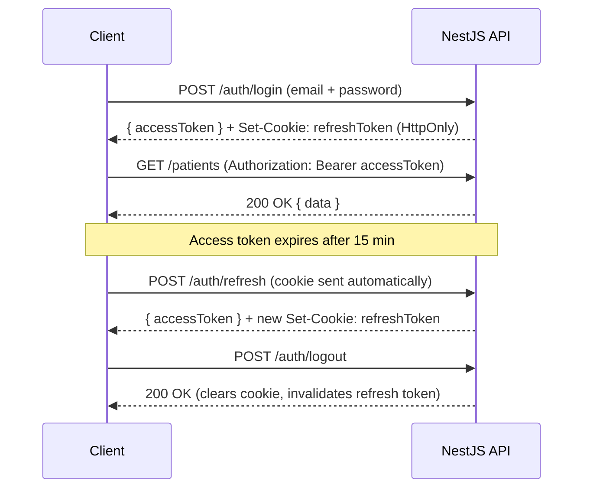

# Lunara — REST API Design

## Overview

The Lunara backend is a **NestJS** application exposing a versioned REST API. All endpoints are prefixed with `/api/v1`. Real-time features (queue updates, lab notifications) are handled via a separate **WebSocket gateway**.

This document defines API conventions, authentication flow, and all endpoint groups.

---

## Table of Contents

- [Base URL](#base-url)
- [Conventions](#conventions)
- [Authentication](#authentication)
- [Error Handling](#error-handling)
- [Endpoints](#endpoints)
  - [Auth](#auth)
  - [Users (Admin)](#users-admin)
  - [Patients](#patients)
  - [Vital Signs](#vital-signs)
  - [Doctor Schedules](#doctor-schedules)
  - [Time Slots](#time-slots)
  - [Appointments](#appointments)
  - [Consultations](#consultations)
  - [SOAP Notes](#soap-notes)
  - [ICD-10 Codes](#icd-10-codes)
  - [Prescriptions](#prescriptions)
  - [Lab Orders](#lab-orders)
  - [Lab Results](#lab-results)
  - [Invoices](#invoices)
  - [Payments](#payments)
  - [Analytics](#analytics)
- [WebSocket Events](#websocket-events)

---

## Base URL

| Environment | URL |
|---|---|
| **Development** | `http://localhost:3001/api/v1` |
| **Production** | `https://lunara-api.onrender.com/api/v1` |

---

## Conventions

### Request Headers

All authenticated requests must include:

```http
Authorization: Bearer <access_token>
Content-Type: application/json
```

### Response Envelope

All responses follow a consistent envelope structure:

**Success:**
```json
{
  "success": true,
  "data": { ... },
  "meta": {
    "page": 1,
    "limit": 20,
    "total": 150
  }
}
```

**Error:**
```json
{
  "success": false,
  "error": {
    "code": "PATIENT_NOT_FOUND",
    "message": "No patient found with MRN: LUN-2024-00042",
    "statusCode": 404
  }
}
```

### Pagination

List endpoints accept:
- `page` (default: `1`)
- `limit` (default: `20`, max: `100`)
- `sortBy` (field name)
- `sortOrder` (`asc` | `desc`)

### Date Format

All dates use **ISO 8601**: `2024-03-15T09:30:00Z`

### Versioning

API version is embedded in the path (`/api/v1`). Breaking changes will increment the version.

---

## Authentication

Lunara uses **JWT Access Tokens** (15-minute TTL) with **Refresh Token Rotation** (7-day TTL, HttpOnly cookie).

### Token Flow



### Role Guard

Every endpoint is protected by a `@Roles()` decorator. Requests from unauthorized roles receive `403 Forbidden`.

---

## Error Handling

| HTTP Status | Error Code | Description |
|---|---|---|
| `400` | `VALIDATION_ERROR` | Invalid request body |
| `401` | `UNAUTHORIZED` | Missing or expired access token |
| `403` | `FORBIDDEN` | Authenticated but insufficient role |
| `404` | `NOT_FOUND` | Resource does not exist |
| `409` | `CONFLICT` | Duplicate resource (e.g., MRN, email) |
| `422` | `UNPROCESSABLE` | Business logic violation |
| `500` | `INTERNAL_ERROR` | Unexpected server error |

---

## Endpoints

---

### Auth

| Method | Endpoint | Roles | Description |
|---|---|---|---|
| `POST` | `/auth/login` | Public | Authenticate user |
| `POST` | `/auth/refresh` | Public (cookie) | Rotate refresh token |
| `POST` | `/auth/logout` | All | Invalidate session |
| `GET` | `/auth/me` | All | Get current user profile |

**POST /auth/login**
```json
// Request
{
  "email": "doctor@lunara.et",
  "password": "securepassword"
}

// Response 200
{
  "success": true,
  "data": {
    "accessToken": "eyJhbGc...",
    "user": {
      "id": "uuid",
      "fullName": "Dr. Abebe Kebede",
      "email": "doctor@lunara.et",
      "role": "doctor",
      "clinicId": "uuid"
    }
  }
}
```

---

### Users (Admin)

| Method | Endpoint | Roles | Description |
|---|---|---|---|
| `GET` | `/users` | `admin` | List all clinic staff |
| `POST` | `/users` | `admin` | Create staff account |
| `GET` | `/users/:id` | `admin` | Get staff member |
| `PATCH` | `/users/:id` | `admin` | Update staff member |
| `DELETE` | `/users/:id` | `admin` | Deactivate staff account |

---

### Patients

| Method | Endpoint | Roles | Description |
|---|---|---|---|
| `GET` | `/patients` | `admin, receptionist, nurse, doctor` | List patients (paginated, searchable) |
| `POST` | `/patients` | `admin, receptionist` | Register new patient |
| `GET` | `/patients/:id` | `admin, receptionist, nurse, doctor` | Get patient profile |
| `GET` | `/patients/mrn/:mrn` | `admin, receptionist, nurse, doctor` | Get patient by MRN |
| `PATCH` | `/patients/:id` | `admin, receptionist` | Update patient profile |
| `DELETE` | `/patients/:id` | `admin` | Soft-delete patient |
| `GET` | `/patients/:id/timeline` | `doctor` | Full patient clinical timeline |

**GET /patients** — Query params:
- `search` — full-text search (name, MRN, phone)
- `page`, `limit`, `sortBy`, `sortOrder`

**POST /patients**
```json
// Request
{
  "fullName": "Fatuma Ali",
  "dateOfBirth": "1990-05-20",
  "sex": "female",
  "phone": "+251911234567",
  "bloodGroup": "B+",
  "allergies": "Penicillin",
  "emergencyContactName": "Ali Hassan",
  "emergencyContactPhone": "+251922345678",
  "emergencyContactRel": "Spouse"
}

// Response 201
{
  "success": true,
  "data": {
    "id": "uuid",
    "mrn": "LUN-2024-00042",
    "fullName": "Fatuma Ali",
    ...
  }
}
```

---

### Vital Signs

| Method | Endpoint | Roles | Description |
|---|---|---|---|
| `POST` | `/vital-signs` | `nurse` | Record vital signs for a patient visit |
| `GET` | `/vital-signs/patient/:patientId` | `doctor, nurse` | Get vital signs history for a patient |
| `GET` | `/vital-signs/appointment/:appointmentId` | `doctor, nurse` | Get vitals for specific appointment |

---

### Doctor Schedules

| Method | Endpoint | Roles | Description |
|---|---|---|---|
| `GET` | `/schedules` | `admin, receptionist` | List all doctor schedules |
| `POST` | `/schedules` | `admin` | Create doctor schedule |
| `GET` | `/schedules/:doctorId` | `admin, receptionist` | Get schedule for a doctor |
| `PATCH` | `/schedules/:id` | `admin` | Update schedule |
| `DELETE` | `/schedules/:id` | `admin` | Remove schedule |

---

### Time Slots

| Method | Endpoint | Roles | Description |
|---|---|---|---|
| `GET` | `/slots` | `admin, receptionist` | Query available slots |
| `POST` | `/slots/generate` | `admin` | Generate slots for a date range |
| `GET` | `/slots/available` | `receptionist` | Get available (unbooked) slots |

**GET /slots/available** — Query params:
- `doctorId` (required)
- `date` (required, `YYYY-MM-DD`)

---

### Appointments

| Method | Endpoint | Roles | Description |
|---|---|---|---|
| `GET` | `/appointments` | `admin, receptionist, doctor` | List appointments (date-filtered) |
| `POST` | `/appointments` | `receptionist` | Book appointment (walk-in or scheduled) |
| `GET` | `/appointments/:id` | `admin, receptionist, doctor, nurse` | Get appointment detail |
| `PATCH` | `/appointments/:id/status` | `receptionist, doctor` | Update appointment status |
| `DELETE` | `/appointments/:id` | `admin, receptionist` | Cancel appointment |
| `GET` | `/appointments/queue/:doctorId` | `doctor, receptionist` | Get today's queue for a doctor |

**PATCH /appointments/:id/status**
```json
// Request
{ "status": "checked_in" }

// Triggers WebSocket event: queue:updated → broadcast to doctor + receptionist
```

---

### Consultations

| Method | Endpoint | Roles | Description |
|---|---|---|---|
| `POST` | `/consultations` | `doctor` | Start consultation for an appointment |
| `GET` | `/consultations/:id` | `doctor` | Get consultation detail |
| `PATCH` | `/consultations/:id` | `doctor` | Update consultation (chief complaint, status) |
| `GET` | `/consultations/patient/:patientId` | `doctor` | Get consultation history for a patient |

---

### SOAP Notes

| Method | Endpoint | Roles | Description |
|---|---|---|---|
| `GET` | `/soap-notes/:consultationId` | `doctor` | Get SOAP notes for a consultation |
| `PUT` | `/soap-notes/:consultationId` | `doctor` | Create or update SOAP notes (upsert) |

**PUT /soap-notes/:consultationId**
```json
// Request
{
  "subjective": "Patient presents with 3-day history of productive cough and fever.",
  "objective": "Temperature: 38.5°C, Pulse: 92bpm, Lungs: bilateral crackles.",
  "assessment": "Likely community-acquired pneumonia.",
  "plan": "Prescribe Amoxicillin 500mg TID for 7 days. Order chest X-ray and CBC."
}
```

---

### ICD-10 Codes

| Method | Endpoint | Roles | Description |
|---|---|---|---|
| `GET` | `/icd10/search` | `doctor` | Autocomplete ICD-10 code search |
| `GET` | `/icd10/:code` | `doctor` | Get ICD-10 code detail |
| `GET` | `/consultations/:id/diagnoses` | `doctor` | Get diagnoses for a consultation |
| `POST` | `/consultations/:id/diagnoses` | `doctor` | Add diagnosis to consultation |
| `DELETE` | `/consultations/:id/diagnoses/:diagnosisId` | `doctor` | Remove diagnosis |

**GET /icd10/search** — Query params:
- `q` (required, min 2 chars) — search query

```json
// GET /icd10/search?q=pneumonia
// Response 200
{
  "success": true,
  "data": [
    { "id": "uuid", "code": "J18.9", "description": "Pneumonia, unspecified organism" },
    { "id": "uuid", "code": "J18.0", "description": "Bronchopneumonia, unspecified organism" },
    { "id": "uuid", "code": "J15.9", "description": "Unspecified bacterial pneumonia" }
  ]
}
```

---

### Prescriptions

| Method | Endpoint | Roles | Description |
|---|---|---|---|
| `POST` | `/prescriptions` | `doctor` | Create prescription for a consultation |
| `GET` | `/prescriptions/:id` | `doctor, cashier` | Get prescription detail |
| `GET` | `/prescriptions/consultation/:consultationId` | `doctor` | Get prescriptions for a consultation |
| `GET` | `/prescriptions/:id/pdf` | `doctor, receptionist` | Download prescription PDF |
| `PATCH` | `/prescriptions/:id` | `doctor` | Update prescription (before finalization) |

**POST /prescriptions**
```json
// Request
{
  "consultationId": "uuid",
  "items": [
    {
      "drugName": "Amoxicillin",
      "dosage": "500mg",
      "frequency": "3 times daily",
      "route": "Oral",
      "durationDays": 7,
      "instructions": "Take after meals"
    }
  ],
  "notes": "Complete the full course even if symptoms improve."
}
```

---

### Lab Orders

| Method | Endpoint | Roles | Description |
|---|---|---|---|
| `POST` | `/lab-orders` | `doctor` | Create lab order |
| `GET` | `/lab-orders` | `lab_technician` | List pending lab orders (technician queue) |
| `GET` | `/lab-orders/:id` | `doctor, lab_technician` | Get lab order detail |
| `PATCH` | `/lab-orders/:id/status` | `lab_technician` | Update lab order status |
| `GET` | `/lab-orders/consultation/:consultationId` | `doctor` | Get lab orders for a consultation |

**POST /lab-orders**
```json
// Request
{
  "consultationId": "uuid",
  "urgency": "routine",
  "notes": "Fasting sample required",
  "items": [
    { "testName": "Complete Blood Count", "testCode": "CBC", "price": 150.00 },
    { "testName": "Fasting Blood Sugar", "testCode": "FBS", "price": 80.00 }
  ]
}
// Triggers WebSocket event: lab:new_order → broadcast to all lab technicians
```

---

### Lab Results

| Method | Endpoint | Roles | Description |
|---|---|---|---|
| `POST` | `/lab-results` | `lab_technician` | Submit lab results |
| `GET` | `/lab-results/:id` | `doctor, lab_technician` | Get lab result |
| `GET` | `/lab-results/lab-order/:labOrderId` | `doctor, lab_technician` | Get results for lab order |
| `GET` | `/lab-results/:id/pdf` | `doctor, lab_technician` | Download lab report PDF |

**POST /lab-results**
```json
// Request
{
  "labOrderId": "uuid",
  "resultData": {
    "WBC": "8.2 x10^3/μL",
    "RBC": "5.1 x10^6/μL",
    "Hemoglobin": "14.5 g/dL",
    "Hematocrit": "43%"
  },
  "interpretation": "Results within normal range. No significant abnormalities detected."
}
// Triggers WebSocket event: lab:result_ready → notify ordering doctor
```

---

### Invoices

| Method | Endpoint | Roles | Description |
|---|---|---|---|
| `GET` | `/invoices` | `admin, cashier` | List invoices (filtered by status/date) |
| `POST` | `/invoices` | `cashier` | Generate invoice for a patient visit |
| `GET` | `/invoices/:id` | `admin, cashier, doctor` | Get invoice detail |
| `PATCH` | `/invoices/:id` | `cashier` | Update invoice (add/remove items) |
| `GET` | `/invoices/:id/pdf` | `cashier, admin` | Download invoice PDF |

**POST /invoices**
```json
// Request
{
  "patientId": "uuid",
  "consultationId": "uuid",
  "items": [
    { "description": "General Consultation", "type": "consultation", "quantity": 1, "unitPrice": 500.00 },
    { "description": "Complete Blood Count", "type": "lab_test", "quantity": 1, "unitPrice": 150.00, "refId": "lab_order_item_uuid" },
    { "description": "Fasting Blood Sugar", "type": "lab_test", "quantity": 1, "unitPrice": 80.00, "refId": "lab_order_item_uuid" }
  ]
}

// Response 201
{
  "success": true,
  "data": {
    "id": "uuid",
    "invoiceNumber": "INV-2024-00187",
    "subtotal": 730.00,
    "total": 730.00,
    "status": "pending"
  }
}
```

---

### Payments

| Method | Endpoint | Roles | Description |
|---|---|---|---|
| `POST` | `/payments` | `cashier` | Record a payment against an invoice |
| `GET` | `/payments/:id` | `admin, cashier` | Get payment detail |
| `GET` | `/payments/invoice/:invoiceId` | `admin, cashier` | Get payments for an invoice |
| `GET` | `/payments/:id/receipt` | `cashier` | Download payment receipt PDF |

**POST /payments**
```json
// Request
{
  "invoiceId": "uuid",
  "method": "telebirr",
  "amount": 730.00,
  "reference": "TBR-20240315-98765"
}
```

---

### Analytics

| Method | Endpoint | Roles | Description |
|---|---|---|---|
| `GET` | `/analytics/revenue` | `admin` | Daily revenue summary by service type |
| `GET` | `/analytics/patient-flow` | `admin` | Consultation volume, wait times, peak hours |
| `GET` | `/analytics/diagnoses` | `admin, doctor` | Top ICD-10 diagnoses over a date range |
| `GET` | `/analytics/lab-turnaround` | `admin` | Average lab result turnaround by test type |

**GET /analytics/revenue** — Query params:
- `from` (`YYYY-MM-DD`, required)
- `to` (`YYYY-MM-DD`, required)

---

## WebSocket Events

The NestJS WebSocket gateway runs on the same port as the HTTP server. Clients connect after authentication using the access token.

### Connection

```typescript
// Frontend (TanStack Start)
const socket = io('wss://lunara-api.onrender.com', {
  auth: { token: accessToken }
});
```

### Events

| Event | Direction | Payload | Subscriber Roles |
|---|---|---|---|
| `queue:updated` | Server → Client | `{ doctorId, queue: Appointment[] }` | `doctor, receptionist` |
| `queue:patient_called` | Server → Client | `{ appointmentId, patientName, queueNumber }` | `receptionist, waiting_area` |
| `lab:new_order` | Server → Client | `{ labOrderId, patientName, tests: string[] }` | `lab_technician` |
| `lab:result_ready` | Server → Client | `{ labOrderId, consultationId, doctorId }` | `doctor` |
| `lab:status_updated` | Server → Client | `{ labOrderId, status }` | `doctor` |

### Rooms

Staff join **clinic-scoped rooms** on connection. Additional rooms are joined based on role:

- `clinic:{clinicId}` — All staff in a clinic
- `doctor:{doctorId}` — Events targeted to a specific doctor
- `lab:queue` — Lab technician queue feed
