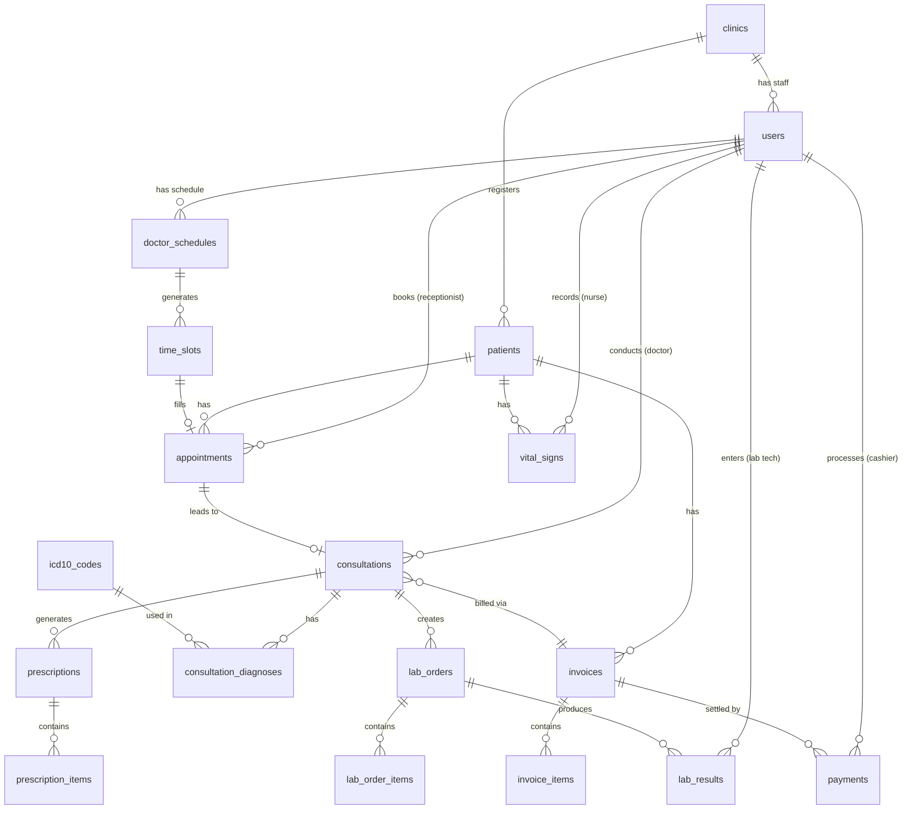

# Lunara — Database Schema

## Overview

Lunara uses **PostgreSQL** (hosted on Supabase) with **Drizzle ORM** for type-safe schema definition, migrations, and queries. This document describes the full entity-relationship design for all core modules.

All tables follow these conventions:
- `id` — UUID primary key (`gen_random_uuid()` default)
- `created_at` / `updated_at` — automatic timestamps
- Soft deletes where applicable using `deleted_at` nullable timestamp
- All foreign keys have explicit `onDelete` behavior defined

---

## Table of Contents

- [Entity Relationship Diagram](#entity-relationship-diagram)
- [Core Entities](#core-entities)
  - [clinics](#clinics)
  - [users](#users)
  - [patients](#patients)
  - [vital_signs](#vital_signs)
  - [doctor_schedules](#doctor_schedules)
  - [time_slots](#time_slots)
  - [appointments](#appointments)
  - [consultations](#consultations)
  - [soap_notes](#soap_notes)
  - [icd10_codes](#icd10_codes)
  - [consultation_diagnoses](#consultation_diagnoses)
  - [prescriptions](#prescriptions)
  - [prescription_items](#prescription_items)
  - [lab_orders](#lab_orders)
  - [lab_order_items](#lab_order_items)
  - [lab_results](#lab_results)
  - [invoices](#invoices)
  - [invoice_items](#invoice_items)
  - [payments](#payments)
  - [audit_logs](#audit_logs)
- [Enums](#enums)
- [Indexes](#indexes)

---

## Entity Relationship Diagram



---

## Core Entities

---

### clinics

Represents a clinic instance. Supports future multi-clinic/SaaS expansion.

```typescript
export const clinics = pgTable('clinics', {
  id:         uuid('id').primaryKey().defaultRandom(),
  name:       varchar('name', { length: 255 }).notNull(),
  address:    text('address'),
  phone:      varchar('phone', { length: 20 }),
  email:      varchar('email', { length: 255 }),
  logoUrl:    text('logo_url'),
  createdAt:  timestamp('created_at').defaultNow().notNull(),
  updatedAt:  timestamp('updated_at').defaultNow().notNull(),
});
```

---

### users

All clinic staff accounts. Role determines access boundaries.

```typescript
export const users = pgTable('users', {
  id:           uuid('id').primaryKey().defaultRandom(),
  clinicId:     uuid('clinic_id').notNull().references(() => clinics.id, { onDelete: 'cascade' }),
  fullName:     varchar('full_name', { length: 255 }).notNull(),
  email:        varchar('email', { length: 255 }).notNull().unique(),
  passwordHash: text('password_hash').notNull(),
  role:         userRoleEnum('role').notNull(),
  phone:        varchar('phone', { length: 20 }),
  isActive:     boolean('is_active').default(true).notNull(),
  lastLoginAt:  timestamp('last_login_at'),
  createdAt:    timestamp('created_at').defaultNow().notNull(),
  updatedAt:    timestamp('updated_at').defaultNow().notNull(),
});
```

**Roles:** `admin | receptionist | nurse | doctor | lab_technician | cashier`

---

### patients

Permanent patient health profiles with unique MRN.

```typescript
export const patients = pgTable('patients', {
  id:               uuid('id').primaryKey().defaultRandom(),
  clinicId:         uuid('clinic_id').notNull().references(() => clinics.id, { onDelete: 'cascade' }),
  mrn:              varchar('mrn', { length: 20 }).notNull().unique(),   // e.g. LUN-2024-00001
  fullName:         varchar('full_name', { length: 255 }).notNull(),
  dateOfBirth:      date('date_of_birth').notNull(),
  sex:              patientSexEnum('sex').notNull(),
  phone:            varchar('phone', { length: 20 }),
  email:            varchar('email', { length: 255 }),
  address:          text('address'),
  bloodGroup:       bloodGroupEnum('blood_group'),
  chronicConditions: text('chronic_conditions'),                         // free-text summary
  allergies:        text('allergies'),                                   // free-text summary
  emergencyContactName:  varchar('emergency_contact_name', { length: 255 }),
  emergencyContactPhone: varchar('emergency_contact_phone', { length: 20 }),
  emergencyContactRel:   varchar('emergency_contact_rel', { length: 100 }),
  createdAt:        timestamp('created_at').defaultNow().notNull(),
  updatedAt:        timestamp('updated_at').defaultNow().notNull(),
  deletedAt:        timestamp('deleted_at'),                             // soft delete
});
```

**MRN Format:** `LUN-YYYY-NNNNN` (auto-generated by the backend on registration)

---

### vital_signs

Triage vitals recorded per patient visit (by nurse).

```typescript
export const vitalSigns = pgTable('vital_signs', {
  id:              uuid('id').primaryKey().defaultRandom(),
  patientId:       uuid('patient_id').notNull().references(() => patients.id, { onDelete: 'cascade' }),
  appointmentId:   uuid('appointment_id').references(() => appointments.id, { onDelete: 'set null' }),
  recordedBy:      uuid('recorded_by').notNull().references(() => users.id),  // nurse
  bloodPressure:   varchar('blood_pressure', { length: 20 }),   // e.g. "120/80"
  temperature:     numeric('temperature', { precision: 4, scale: 1 }),        // °C
  pulseRate:       integer('pulse_rate'),                                      // bpm
  respiratoryRate: integer('respiratory_rate'),                                // breaths/min
  oxygenSaturation: numeric('oxygen_saturation', { precision: 4, scale: 1 }), // %
  weightKg:        numeric('weight_kg', { precision: 5, scale: 2 }),
  heightCm:        numeric('height_cm', { precision: 5, scale: 1 }),
  bmi:             numeric('bmi', { precision: 4, scale: 2 }),                // auto-calculated
  notes:           text('notes'),
  recordedAt:      timestamp('recorded_at').defaultNow().notNull(),
});
```

---

### doctor_schedules

Defines weekly availability for each doctor.

```typescript
export const doctorSchedules = pgTable('doctor_schedules', {
  id:                  uuid('id').primaryKey().defaultRandom(),
  doctorId:            uuid('doctor_id').notNull().references(() => users.id, { onDelete: 'cascade' }),
  dayOfWeek:           integer('day_of_week').notNull(),  // 0=Sunday, 1=Monday, ..., 6=Saturday
  startTime:           time('start_time').notNull(),       // e.g. "08:00"
  endTime:             time('end_time').notNull(),          // e.g. "17:00"
  slotDurationMinutes: integer('slot_duration_minutes').notNull().default(30),
  isActive:            boolean('is_active').default(true).notNull(),
  createdAt:           timestamp('created_at').defaultNow().notNull(),
});
```

---

### time_slots

Individual appointment slots generated from doctor schedules.

```typescript
export const timeSlots = pgTable('time_slots', {
  id:         uuid('id').primaryKey().defaultRandom(),
  scheduleId: uuid('schedule_id').notNull().references(() => doctorSchedules.id, { onDelete: 'cascade' }),
  doctorId:   uuid('doctor_id').notNull().references(() => users.id),
  date:       date('date').notNull(),
  startTime:  time('start_time').notNull(),
  endTime:    time('end_time').notNull(),
  isBooked:   boolean('is_booked').default(false).notNull(),
  createdAt:  timestamp('created_at').defaultNow().notNull(),
});
```

---

### appointments

Links a patient to a time slot. Walk-ins use a null `slotId`.

```typescript
export const appointments = pgTable('appointments', {
  id:            uuid('id').primaryKey().defaultRandom(),
  clinicId:      uuid('clinic_id').notNull().references(() => clinics.id),
  patientId:     uuid('patient_id').notNull().references(() => patients.id),
  doctorId:      uuid('doctor_id').notNull().references(() => users.id),
  slotId:        uuid('slot_id').references(() => timeSlots.id, { onDelete: 'set null' }), // null = walk-in
  bookedBy:      uuid('booked_by').notNull().references(() => users.id),  // receptionist
  queueNumber:   integer('queue_number').notNull(),
  type:          appointmentTypeEnum('type').notNull().default('walk_in'),
  status:        appointmentStatusEnum('status').notNull().default('scheduled'),
  scheduledDate: date('scheduled_date').notNull(),
  notes:         text('notes'),
  createdAt:     timestamp('created_at').defaultNow().notNull(),
  updatedAt:     timestamp('updated_at').defaultNow().notNull(),
});
```

**Status lifecycle:** `scheduled → checked_in → in_progress → completed | no_show | cancelled`

---

### consultations

Doctor's primary clinical record per appointment.

```typescript
export const consultations = pgTable('consultations', {
  id:            uuid('id').primaryKey().defaultRandom(),
  appointmentId: uuid('appointment_id').notNull().unique().references(() => appointments.id),
  doctorId:      uuid('doctor_id').notNull().references(() => users.id),
  patientId:     uuid('patient_id').notNull().references(() => patients.id),
  status:        consultationStatusEnum('status').notNull().default('in_progress'),
  chiefComplaint: text('chief_complaint'),
  startedAt:     timestamp('started_at').defaultNow().notNull(),
  completedAt:   timestamp('completed_at'),
  createdAt:     timestamp('created_at').defaultNow().notNull(),
  updatedAt:     timestamp('updated_at').defaultNow().notNull(),
});
```

---

### soap_notes

Structured clinical notes tied to a consultation (one-to-one).

```typescript
export const soapNotes = pgTable('soap_notes', {
  id:             uuid('id').primaryKey().defaultRandom(),
  consultationId: uuid('consultation_id').notNull().unique().references(() => consultations.id, { onDelete: 'cascade' }),
  subjective:     text('subjective'),    // Chief complaint, history of present illness
  objective:      text('objective'),     // Physical examination findings
  assessment:     text('assessment'),    // Doctor's clinical assessment
  plan:           text('plan'),          // Treatment plan narrative
  updatedAt:      timestamp('updated_at').defaultNow().notNull(),
});
```

---

### icd10_codes

Local ICD-10 diagnostic code lookup table. Seeded from WHO ICD-10 dataset.

```typescript
export const icd10Codes = pgTable('icd10_codes', {
  id:          uuid('id').primaryKey().defaultRandom(),
  code:        varchar('code', { length: 10 }).notNull().unique(),   // e.g. "J00", "A01.0"
  description: text('description').notNull(),                        // e.g. "Acute nasopharyngitis"
  category:    varchar('category', { length: 100 }),                 // ICD-10 chapter grouping
  searchVector: tsvector('search_vector'),                           // PostgreSQL FTS vector
});
```

> **Search Strategy:** The `search_vector` column is populated by a PostgreSQL trigger combining `code` and `description` fields. Queries use `to_tsquery` with `websearch_to_tsquery` for natural-language autocomplete. See [Indexes](#indexes) for the GIN index definition.

---

### consultation_diagnoses

Many-to-many: links consultations to one or more ICD-10 codes.

```typescript
export const consultationDiagnoses = pgTable('consultation_diagnoses', {
  id:             uuid('id').primaryKey().defaultRandom(),
  consultationId: uuid('consultation_id').notNull().references(() => consultations.id, { onDelete: 'cascade' }),
  icd10CodeId:    uuid('icd10_code_id').notNull().references(() => icd10Codes.id),
  isPrimary:      boolean('is_primary').default(false).notNull(),  // primary vs. secondary diagnosis
  notes:          text('notes'),
  createdAt:      timestamp('created_at').defaultNow().notNull(),
});
```

---

### prescriptions

Digital prescription per consultation.

```typescript
export const prescriptions = pgTable('prescriptions', {
  id:             uuid('id').primaryKey().defaultRandom(),
  consultationId: uuid('consultation_id').notNull().references(() => consultations.id, { onDelete: 'cascade' }),
  doctorId:       uuid('doctor_id').notNull().references(() => users.id),
  patientId:      uuid('patient_id').notNull().references(() => patients.id),
  notes:          text('notes'),           // general prescription notes
  pdfUrl:         text('pdf_url'),         // Puppeteer-generated PDF URL
  createdAt:      timestamp('created_at').defaultNow().notNull(),
});
```

---

### prescription_items

Individual medication entries within a prescription.

```typescript
export const prescriptionItems = pgTable('prescription_items', {
  id:             uuid('id').primaryKey().defaultRandom(),
  prescriptionId: uuid('prescription_id').notNull().references(() => prescriptions.id, { onDelete: 'cascade' }),
  drugName:       varchar('drug_name', { length: 255 }).notNull(),
  dosage:         varchar('dosage', { length: 100 }).notNull(),      // e.g. "500mg"
  frequency:      varchar('frequency', { length: 100 }).notNull(),   // e.g. "3 times daily"
  route:          varchar('route', { length: 100 }),                 // e.g. "Oral", "IV"
  durationDays:   integer('duration_days'),
  instructions:   text('instructions'),                              // special notes
  sortOrder:      integer('sort_order').default(0),
});
```

---

### lab_orders

Laboratory test order dispatched by a doctor during consultation.

```typescript
export const labOrders = pgTable('lab_orders', {
  id:             uuid('id').primaryKey().defaultRandom(),
  consultationId: uuid('consultation_id').notNull().references(() => consultations.id, { onDelete: 'cascade' }),
  doctorId:       uuid('doctor_id').notNull().references(() => users.id),
  patientId:      uuid('patient_id').notNull().references(() => patients.id),
  status:         labOrderStatusEnum('status').notNull().default('pending'),
  urgency:        labUrgencyEnum('urgency').notNull().default('routine'),
  notes:          text('notes'),
  requestedAt:    timestamp('requested_at').defaultNow().notNull(),
  completedAt:    timestamp('completed_at'),
});
```

**Status lifecycle:** `pending → sample_collected → processing → completed`

---

### lab_order_items

Individual tests within a lab order.

```typescript
export const labOrderItems = pgTable('lab_order_items', {
  id:           uuid('id').primaryKey().defaultRandom(),
  labOrderId:   uuid('lab_order_id').notNull().references(() => labOrders.id, { onDelete: 'cascade' }),
  testName:     varchar('test_name', { length: 255 }).notNull(),  // e.g. "Complete Blood Count"
  testCode:     varchar('test_code', { length: 50 }),             // internal lab code
  price:        numeric('price', { precision: 10, scale: 2 }).notNull(),
  status:       labItemStatusEnum('status').notNull().default('pending'),
});
```

---

### lab_results

Results entered by the lab technician per lab order.

```typescript
export const labResults = pgTable('lab_results', {
  id:              uuid('id').primaryKey().defaultRandom(),
  labOrderId:      uuid('lab_order_id').notNull().references(() => labOrders.id, { onDelete: 'cascade' }),
  enteredBy:       uuid('entered_by').notNull().references(() => users.id),  // lab technician
  resultData:      jsonb('result_data'),    // structured result values (test-specific)
  interpretation:  text('interpretation'), // technician's notes
  fileUrl:         text('file_url'),        // attached report PDF or image
  pdfUrl:          text('pdf_url'),         // Puppeteer-generated report PDF
  enteredAt:       timestamp('entered_at').defaultNow().notNull(),
});
```

---

### invoices

Billing invoice generated per patient visit.

```typescript
export const invoices = pgTable('invoices', {
  id:             uuid('id').primaryKey().defaultRandom(),
  clinicId:       uuid('clinic_id').notNull().references(() => clinics.id),
  patientId:      uuid('patient_id').notNull().references(() => patients.id),
  consultationId: uuid('consultation_id').references(() => consultations.id, { onDelete: 'set null' }),
  invoiceNumber:  varchar('invoice_number', { length: 30 }).notNull().unique(),  // e.g. INV-2024-00001
  subtotal:       numeric('subtotal', { precision: 10, scale: 2 }).notNull(),
  discount:       numeric('discount', { precision: 10, scale: 2 }).default('0'),
  total:          numeric('total', { precision: 10, scale: 2 }).notNull(),
  status:         invoiceStatusEnum('status').notNull().default('pending'),
  notes:          text('notes'),
  issuedAt:       timestamp('issued_at').defaultNow().notNull(),
  dueAt:          timestamp('due_at'),
  createdAt:      timestamp('created_at').defaultNow().notNull(),
  updatedAt:      timestamp('updated_at').defaultNow().notNull(),
});
```

---

### invoice_items

Line items within an invoice (consultation fee, lab tests, procedures).

```typescript
export const invoiceItems = pgTable('invoice_items', {
  id:           uuid('id').primaryKey().defaultRandom(),
  invoiceId:    uuid('invoice_id').notNull().references(() => invoices.id, { onDelete: 'cascade' }),
  description:  varchar('description', { length: 255 }).notNull(),
  type:         invoiceItemTypeEnum('type').notNull(),  // consultation | lab_test | procedure | supply
  quantity:     integer('quantity').notNull().default(1),
  unitPrice:    numeric('unit_price', { precision: 10, scale: 2 }).notNull(),
  total:        numeric('total', { precision: 10, scale: 2 }).notNull(),
  refId:        uuid('ref_id'),  // optional reference to lab_order_item or consultation
});
```

---

### payments

Payment records linked to an invoice. Multiple payments per invoice for partial payments.

```typescript
export const payments = pgTable('payments', {
  id:            uuid('id').primaryKey().defaultRandom(),
  invoiceId:     uuid('invoice_id').notNull().references(() => invoices.id, { onDelete: 'cascade' }),
  processedBy:   uuid('processed_by').notNull().references(() => users.id),  // cashier
  method:        paymentMethodEnum('method').notNull(),
  amount:        numeric('amount', { precision: 10, scale: 2 }).notNull(),
  reference:     varchar('reference', { length: 255 }),  // Telebirr/CBE transaction reference
  receiptNumber: varchar('receipt_number', { length: 30 }),
  paidAt:        timestamp('paid_at').defaultNow().notNull(),
});
```

**Payment methods:** `cash | telebirr | cbe_birr`

---

### audit_logs

Immutable audit trail for all data mutations (HIPAA compliance).

```typescript
export const auditLogs = pgTable('audit_logs', {
  id:         uuid('id').primaryKey().defaultRandom(),
  clinicId:   uuid('clinic_id').references(() => clinics.id),
  userId:     uuid('user_id').references(() => users.id, { onDelete: 'set null' }),
  action:     varchar('action', { length: 100 }).notNull(),   // e.g. "UPDATE_PATIENT"
  entityType: varchar('entity_type', { length: 100 }).notNull(),  // e.g. "patients"
  entityId:   uuid('entity_id'),
  oldData:    jsonb('old_data'),   // snapshot before change
  newData:    jsonb('new_data'),   // snapshot after change
  ipAddress:  varchar('ip_address', { length: 45 }),
  userAgent:  text('user_agent'),
  createdAt:  timestamp('created_at').defaultNow().notNull(),
});
```

---

## Enums

```typescript
// User roles
export const userRoleEnum = pgEnum('user_role', [
  'admin', 'receptionist', 'nurse', 'doctor', 'lab_technician', 'cashier'
]);

// Patient sex
export const patientSexEnum = pgEnum('patient_sex', ['male', 'female', 'other']);

// Blood group
export const bloodGroupEnum = pgEnum('blood_group', [
  'A+', 'A-', 'B+', 'B-', 'AB+', 'AB-', 'O+', 'O-'
]);

// Appointment type
export const appointmentTypeEnum = pgEnum('appointment_type', ['walk_in', 'scheduled']);

// Appointment status
export const appointmentStatusEnum = pgEnum('appointment_status', [
  'scheduled', 'checked_in', 'in_progress', 'completed', 'no_show', 'cancelled'
]);

// Consultation status
export const consultationStatusEnum = pgEnum('consultation_status', [
  'in_progress', 'completed', 'cancelled'
]);

// Lab order status
export const labOrderStatusEnum = pgEnum('lab_order_status', [
  'pending', 'sample_collected', 'processing', 'completed', 'cancelled'
]);

// Lab order item status
export const labItemStatusEnum = pgEnum('lab_item_status', [
  'pending', 'completed', 'cancelled'
]);

// Lab urgency
export const labUrgencyEnum = pgEnum('lab_urgency', ['routine', 'urgent', 'stat']);

// Invoice status
export const invoiceStatusEnum = pgEnum('invoice_status', [
  'pending', 'partial', 'paid', 'cancelled'
]);

// Invoice item type
export const invoiceItemTypeEnum = pgEnum('invoice_item_type', [
  'consultation', 'lab_test', 'procedure', 'supply'
]);

// Payment method
export const paymentMethodEnum = pgEnum('payment_method', [
  'cash', 'telebirr', 'cbe_birr'
]);
```

---

## Indexes

```sql
-- Fast patient search by MRN and name
CREATE UNIQUE INDEX idx_patients_mrn ON patients(mrn);
CREATE INDEX idx_patients_full_name ON patients USING gin(to_tsvector('english', full_name));

-- ICD-10 full-text search (autocomplete)
CREATE INDEX idx_icd10_search ON icd10_codes USING gin(search_vector);

-- Trigger to maintain ICD-10 search vector
CREATE OR REPLACE FUNCTION update_icd10_search_vector()
RETURNS TRIGGER AS $$
BEGIN
  NEW.search_vector := to_tsvector('english', COALESCE(NEW.code, '') || ' ' || COALESCE(NEW.description, ''));
  RETURN NEW;
END;
$$ LANGUAGE plpgsql;

CREATE TRIGGER icd10_search_vector_update
  BEFORE INSERT OR UPDATE ON icd10_codes
  FOR EACH ROW EXECUTE FUNCTION update_icd10_search_vector();

-- Queue and appointment lookups
CREATE INDEX idx_appointments_clinic_date ON appointments(clinic_id, scheduled_date);
CREATE INDEX idx_appointments_doctor_date ON appointments(doctor_id, scheduled_date);
CREATE INDEX idx_appointments_status ON appointments(status);

-- Time slot availability
CREATE INDEX idx_time_slots_doctor_date ON time_slots(doctor_id, date);
CREATE INDEX idx_time_slots_is_booked ON time_slots(is_booked);

-- Lab order queue for lab technician
CREATE INDEX idx_lab_orders_status ON lab_orders(status);
CREATE INDEX idx_lab_orders_clinic_date ON lab_orders(requested_at DESC);

-- Invoice lookup
CREATE UNIQUE INDEX idx_invoices_number ON invoices(invoice_number);
CREATE INDEX idx_invoices_patient ON invoices(patient_id);
CREATE INDEX idx_invoices_status ON invoices(status);

-- Audit log lookups
CREATE INDEX idx_audit_logs_entity ON audit_logs(entity_type, entity_id);
CREATE INDEX idx_audit_logs_user ON audit_logs(user_id, created_at DESC);
```
