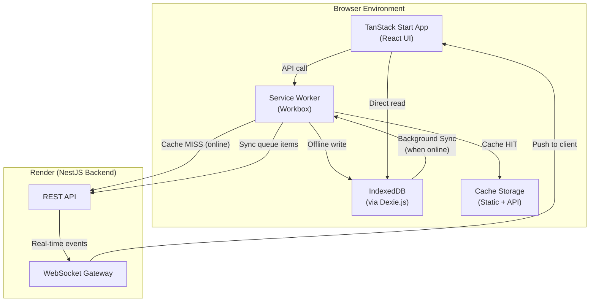

# Lunara — PWA Architecture & Offline-First Strategy

## Overview

Lunara is built as an **offline-first Progressive Web Application** to support Ethiopian clinic environments where internet connectivity may be intermittent or unstable. Clinical workflows must continue during network disruptions, with data synchronized automatically when connectivity is restored.

This document defines the service worker caching strategy, IndexedDB schema, sync conflict resolution approach, and the boundaries of offline capability.

---

## Table of Contents

- [PWA Capabilities](#pwa-capabilities)
- [Architecture Overview](#architecture-overview)
- [Service Worker Strategy](#service-worker-strategy)
  - [Cache Layers](#cache-layers)
  - [Caching Strategies by Route Type](#caching-strategies-by-route-type)
- [IndexedDB Schema](#indexeddb-schema)
- [Offline-Capable Workflows](#offline-capable-workflows)
- [Sync Strategy](#sync-strategy)
  - [Background Sync Queue](#background-sync-queue)
  - [Conflict Resolution](#conflict-resolution)
- [Real-Time Features (WebSocket) Offline Handling](#real-time-features-websocket-offline-handling)
- [Installation & App Shell](#installation--app-shell)
- [PDF Generation Offline](#pdf-generation-offline)

---

## PWA Capabilities

| Capability | Status |
|---|---|
| **Installable** (Add to Home Screen) | ✅ Phase 4 |
| **Offline App Shell** | ✅ Phase 4 |
| **Offline data access** (cached reads) | ✅ Phase 4 |
| **Offline data entry** (vitals, SOAP notes) | ✅ Phase 4 |
| **Background synchronization** | ✅ Phase 4 |
| **Push notifications** | 🔜 Future |
| **Responsive (desktop, tablet, mobile)** | ✅ All phases |

---

## Architecture Overview



---

## Service Worker Strategy

Lunara uses **Workbox** (integrated via the TanStack Start PWA plugin) to manage service worker lifecycle and caching.

### Cache Layers

| Cache Name | Contents | Strategy |
|---|---|---|
| `lunara-app-shell-v1` | HTML, CSS, JS bundles, fonts, icons | Cache First |
| `lunara-static-v1` | Images, SVGs, static assets | Cache First |
| `lunara-api-v1` | GET API responses (patients, schedules, ICD-10) | Stale While Revalidate |
| `lunara-icd10-v1` | ICD-10 dataset API responses | Cache First (long TTL) |

### Caching Strategies by Route Type

#### App Shell — Cache First
```
/ (root HTML)
/login
/dashboard
/patients
/appointments
/consultations
/lab-orders
/billing
```
The app shell is always served from cache. The Service Worker intercepts navigation requests and serves the cached shell instantly, then React hydrates on the client.

#### Static Assets — Cache First
```
*.css, *.js, *.woff2, *.png, *.svg, *.ico
```
Versioned bundle hashes ensure stale assets are never served post-deployment.

#### API Reads — Stale While Revalidate
```
GET /api/v1/patients*
GET /api/v1/appointments*
GET /api/v1/schedules*
GET /api/v1/slots*
GET /api/v1/consultations*
```
The cached response is returned immediately (fast UI), while a background fetch updates the cache. Maximum cache age: **5 minutes** for frequently changing data.

#### ICD-10 Lookup — Cache First (Long TTL)
```
GET /api/v1/icd10/search*
GET /api/v1/icd10/:code
```
ICD-10 data changes rarely. Cached for **7 days**. Enables fully offline ICD-10 autocomplete search.

#### Authenticated Write Endpoints — Network Only (with Offline Queue)
```
POST, PATCH, DELETE /api/v1/*
```
Write requests are **Network Only**. If the network is unavailable, the request is captured and stored in the **Background Sync queue** (IndexedDB), to be retried when connectivity resumes.

---

## IndexedDB Schema

Lunara uses **Dexie.js** as the IndexedDB wrapper for a clean TypeScript API.

```typescript
// db.ts — Dexie.js schema
import Dexie, { type Table } from 'dexie';

export class LunaraDB extends Dexie {
  patients!: Table<PatientRecord>;
  appointments!: Table<AppointmentRecord>;
  vitalSigns!: Table<VitalSignsRecord>;
  consultations!: Table<ConsultationRecord>;
  soapNotes!: Table<SoapNotesRecord>;
  icd10Codes!: Table<Icd10Record>;
  syncQueue!: Table<SyncQueueItem>;

  constructor() {
    super('LunaraDB');
    this.version(1).stores({
      patients:      '++id, mrn, fullName, clinicId, updatedAt',
      appointments:  '++id, patientId, doctorId, scheduledDate, status, clinicId',
      vitalSigns:    '++id, patientId, appointmentId, recordedAt',
      consultations: '++id, appointmentId, doctorId, patientId, status',
      soapNotes:     '++id, consultationId',
      icd10Codes:    '++id, code, *description',  // multi-entry for full-text
      syncQueue:     '++id, endpoint, method, status, createdAt',
    });
  }
}

export const db = new LunaraDB();
```

### Sync Queue Schema

```typescript
interface SyncQueueItem {
  id?: number;
  endpoint: string;          // e.g. '/api/v1/vital-signs'
  method: 'POST' | 'PATCH' | 'DELETE';
  body: object;              // request payload
  headers: Record<string, string>;
  status: 'pending' | 'retrying' | 'failed';
  retryCount: number;
  createdAt: Date;
  lastAttemptAt?: Date;
  errorMessage?: string;
}
```

---

## Offline-Capable Workflows

The following workflows are designed to function without internet:

### ✅ Fully Offline

| Workflow | How |
|---|---|
| **View patient list** | Served from `lunara-api-v1` cache or IndexedDB |
| **Search patients by name/MRN** | IndexedDB local query |
| **View patient profile** | Cached API response |
| **ICD-10 diagnosis autocomplete** | `lunara-icd10-v1` cache or IndexedDB `icd10Codes` store |
| **Record vital signs** | Written to IndexedDB → queued to sync |
| **Write SOAP notes** | Written to IndexedDB → queued to sync |
| **View today's appointment queue** | Cached from last fetch |
| **View consultation history** | Cached API response |

### ⚠️ Degraded Offline (Partial Functionality)

| Workflow | Limitation |
|---|---|
| **Book new appointment** | Queued for sync; confirmation number shown when online |
| **Create prescription** | Draft saved to IndexedDB; PDF generated only when online |
| **Submit lab results** | Queued for sync; no real-time notification until online |
| **Generate invoice** | Queued for sync |

### ❌ Online Required

| Workflow | Reason |
|---|---|
| **Real-time queue updates** | WebSocket connection required |
| **Lab result notifications** | WebSocket connection required |
| **PDF download** | Puppeteer runs on the server |
| **User authentication (login)** | JWT verification requires server |
| **Payment processing** | Telebirr/CBE Birr requires API confirmation |

---

## Sync Strategy

### Background Sync Queue

When an offline write operation is attempted (vital signs, SOAP notes, etc.):

1. The UI writes data to **IndexedDB** immediately (optimistic update).
2. The failed request is stored in the `syncQueue` IndexedDB store.
3. The service worker registers a **Background Sync** event (`sync` event tag: `lunara-sync-queue`).
4. When connectivity is restored (or when the browser decides to fire the sync), the service worker processes the queue.

```typescript
// service-worker.ts
self.addEventListener('sync', (event: SyncEvent) => {
  if (event.tag === 'lunara-sync-queue') {
    event.waitUntil(processSyncQueue());
  }
});

async function processSyncQueue() {
  const pendingItems = await db.syncQueue
    .where('status').equals('pending')
    .sortBy('createdAt');

  for (const item of pendingItems) {
    try {
      await fetch(item.endpoint, {
        method: item.method,
        body: JSON.stringify(item.body),
        headers: item.headers,
      });
      await db.syncQueue.delete(item.id!);
    } catch (error) {
      await db.syncQueue.update(item.id!, {
        status: item.retryCount >= 3 ? 'failed' : 'retrying',
        retryCount: item.retryCount + 1,
        lastAttemptAt: new Date(),
        errorMessage: String(error),
      });
    }
  }
}
```

### Queue Order

Sync queue items are processed in **creation order** (FIFO) to preserve data consistency. For example, a consultation must sync before its associated SOAP notes.

### Retry Policy

| Retry Count | Delay |
|---|---|
| 1st retry | Immediate (on next sync event) |
| 2nd retry | 5 minutes |
| 3rd retry | 30 minutes |
| 4+ retries | Marked as `failed`, user notified |

### Conflict Resolution

Since multiple staff may be editing data (e.g., a nurse updates vitals while a doctor reads from cache), Lunara uses a **last-write-wins** strategy with server-side timestamps:

1. Every entity has a server-side `updated_at` timestamp.
2. When syncing, the client sends its local `updated_at` in an `If-Unmodified-Since` header.
3. If the server version is newer (edited by another user while this client was offline), the server returns `409 Conflict`.
4. On conflict: the server version **wins** and overwrites the local IndexedDB entry.
5. The user is notified with a toast: *"Your changes were overwritten by a more recent server update."*

> **Design Decision:** In a healthcare context, server data (from another clinician who was online) is always treated as more authoritative than locally queued edits. This prevents stale drafts from overwriting confirmed clinical data.

---

## Real-Time Features (WebSocket) Offline Handling

WebSocket events (queue updates, lab notifications) are only received when online. When the client goes offline:

1. The WebSocket connection drops automatically.
2. The UI shows an **offline indicator** banner.
3. Queue and lab data continue to be served from cache (stale).
4. On reconnection, the client:
   - Re-establishes the WebSocket connection.
   - Fetches a **delta update** from the REST API (appointments and lab orders updated since last sync).
   - Refreshes the UI and local cache.

```typescript
// useWebSocket.ts
socket.on('disconnect', () => {
  setIsOffline(true);
});

socket.on('connect', async () => {
  setIsOffline(false);
  // Fetch updates since last known sync timestamp
  await refreshQueueData(lastSyncTimestamp);
  setLastSyncTimestamp(new Date());
});
```

---

## Installation & App Shell

Lunara is installable as a PWA on:
- **Desktop:** Chrome, Edge, Firefox (Windows, macOS, Linux)
- **Tablet:** iPad (Safari), Android tablets (Chrome)
- **Mobile:** Android (Chrome), iOS (Safari, limited Background Sync support)

### Web App Manifest

```json
{
  "name": "Lunara",
  "short_name": "Lunara",
  "description": "Digital Clinic Management & EHR Platform",
  "start_url": "/",
  "display": "standalone",
  "background_color": "#0f172a",
  "theme_color": "#6366f1",
  "icons": [
    { "src": "/icons/icon-192.png", "sizes": "192x192", "type": "image/png" },
    { "src": "/icons/icon-512.png", "sizes": "512x512", "type": "image/png" },
    { "src": "/icons/icon-maskable.png", "sizes": "512x512", "type": "image/png", "purpose": "maskable" }
  ]
}
```

---

## PDF Generation Offline

PDF generation (prescriptions and lab reports) requires **Puppeteer running on the NestJS server** and therefore requires an active internet connection.

**Offline fallback:** A simplified HTML print view is generated client-side using the browser's native `window.print()` API. This serves as an emergency fallback for printing prescriptions during offline situations, without the clinic letterhead styling of the server-generated PDF.

```typescript
// prescription-print.ts (client-side fallback)
export function printPrescriptionFallback(prescription: Prescription) {
  const printWindow = window.open('', '_blank');
  printWindow?.document.write(renderPrescriptionHTML(prescription));
  printWindow?.print();
}
```
